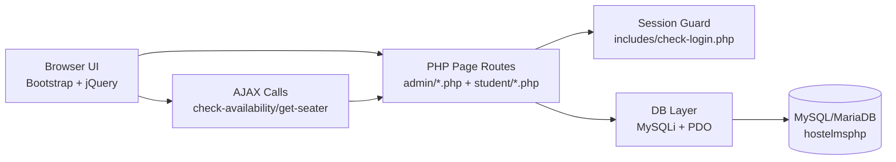
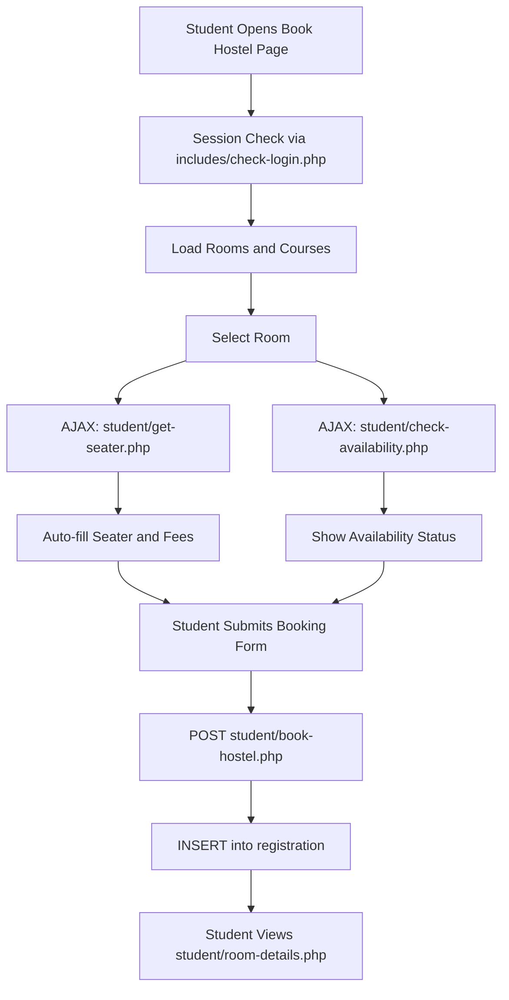
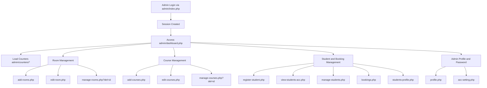
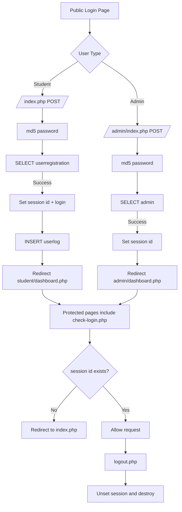
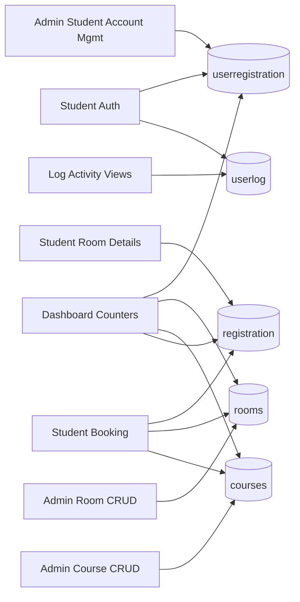

<p align="center">
	
</p>

<h1 align="center">🏨 Hostel Management System</h1>

<p align="center">
	<strong>Student Hostel Booking + Admin Management Portal (PHP + MySQL)</strong>
	<br />
	Student login, room booking, course and room management, student account management, and dashboard analytics.
</p>

<p align="center">
	
	
	
	
	
	
</p>

## 📚 Table of Contents

- [Project Overview](#-project-overview)
- [Core Features](#-core-features)
- [Architecture Flow](#-architecture-flow)
- [Tech Stack Details](#-tech-stack-details)
- [Project Structure](#-project-structure)
- [Codebase Responsibility Map](#-codebase-responsibility-map)
- [File-by-File Work and Usage](#-file-by-file-work-and-usage)
- [Feature-to-File Mapping](#-feature-to-file-mapping)
- [Student Booking Request Lifecycle](#-student-booking-request-lifecycle)
- [Admin Management Request Lifecycle](#-admin-management-request-lifecycle)
- [Authentication Lifecycle (Session Internals)](#-authentication-lifecycle-session-internals)
- [Database Transaction Path](#-database-transaction-path)
- [Contributor Onboarding Checklist](#-contributor-onboarding-checklist)
- [Frontend Endpoints (UI Routes)](#-frontend-endpoints-ui-routes)
- [Backend Endpoints (Form and Action Handlers)](#-backend-endpoints-form-and-action-handlers)
- [AJAX and API-like Endpoints](#-ajax-and-api-like-endpoints)
- [Counter Endpoints](#-counter-endpoints)
- [API Quick Examples](#-api-quick-examples)
- [Database Reference](#-database-reference)
- [DBMS Keys and Relationship Types](#-dbms-keys-and-relationship-types)
- [ER Diagram (Logical)](#-er-diagram-logical)
- [How to Run the Project](#-how-to-run-the-project)
- [Configuration Guide](#-configuration-guide)
- [Default Credentials](#-default-credentials)
- [Troubleshooting](#-troubleshooting)
- [Security Notes and Known Caveats](#-security-notes-and-known-caveats)

---

## 📌 Project Overview

This project is a complete hostel management web application with separate student and admin panels.

- 👨‍🎓 Student side includes login, profile update, password change, hostel booking, room details, and login activity history.
- 👨‍💼 Admin side includes student registration, account management, room and course CRUD, and booking management.
- 📊 Both dashboards show quick count cards for rooms, courses, students, and booked rooms.
- ⚙️ Real-time form checks are done with jQuery AJAX (room availability, email validation, password checks, room seater/fees lookup).

> Important: this codebase is a PHP monolith. It does not expose a JSON REST API. "API-like" behavior is implemented as PHP AJAX endpoints returning HTML snippets or plain text.

## ✨ Core Features

| Area | What is implemented |
|---|---|
| Authentication | Student and admin login with PHP sessions |
| Student Booking | Full hostel booking form with guardian + address details |
| Room Management | Add, edit, list, delete rooms |
| Course Management | Add, edit, list, delete courses |
| Student Registry | Admin can register student accounts and manage records |
| Dashboard Analytics | Live counts of registered students, rooms, courses, bookings |
| Activity Tracking | Student login history with city/country/IP logging |
| AJAX Utilities | Email check, old-password check, room availability check, seater/fee autofill |

## 🧱 Architecture Flow



## 🛠️ Tech Stack Details

### Backend

- PHP (session-based monolith)
- MySQLi prepared statements (majority of operations)
- PDO used in `get-seater.php` handlers
- Session authorization via `$_SESSION['id']`

### Frontend

- Bootstrap 4
- jQuery
- DataTables (Bootstrap 4 integration)
- Charting libs: C3, Chartist, Morris.js, Chart.js
- Feather icons

### Build and Asset Tooling

- Node.js + npm
- Gulp tasks:
	- SCSS compile
	- CSS minification
	- JS minification
	- vendor copy to assets

### Database

- MySQL / MariaDB
- SQL dump included at `Database/hostelmsphp.sql`
- Database name: `hostelmsphp`

## 🗂️ Project Structure

```text
Hotel-Management-System/
├── index.php
├── admin/
│   ├── index.php
│   ├── dashboard.php
│   ├── add-rooms.php
│   ├── manage-rooms.php
│   ├── edit-room.php
│   ├── add-courses.php
│   ├── manage-courses.php
│   ├── edit-courses.php
│   ├── register-student.php
│   ├── view-students-acc.php
│   ├── manage-students.php
│   ├── students-profile.php
│   ├── bookings.php
│   ├── profile.php
│   ├── acc-setting.php
│   ├── check-availability.php
│   ├── check-availability-admin.php
│   ├── get-seater.php
│   ├── counters/
│   └── includes/
├── student/
│   ├── dashboard.php
│   ├── book-hostel.php
│   ├── room-details.php
│   ├── profile.php
│   ├── acc-setting.php
│   ├── log-activity.php
│   ├── check-availability.php
│   ├── get-seater.php
│   ├── counters/
│   └── logout.php
├── includes/
│   ├── dbconn.php
│   ├── pdoconfig.php
│   ├── check-login.php
│   ├── student-navigation.php
│   └── student-sidebar.php
├── assets/
├── dist/
├── scss/
├── Database/
│   └── hostelmsphp.sql
├── package.json
└── gulpfile.js
```

## 🧭 Codebase Responsibility Map

This section explains what each major directory owns and why it exists in the project.

| Folder/File | What it contains | Why it is used in the project |
|---|---|---|
| `/index.php` | Student login entry page and login submit handler | Main public entry point for student authentication |
| `/admin/` | Admin panel pages and admin-specific actions | Central control panel for managing rooms, courses, students, and bookings |
| `/student/` | Student panel pages and student-specific actions | Student self-service portal for booking and account management |
| `/includes/` | Shared DB config, session guard, shared UI includes | Reusable runtime utilities used by both panels |
| `/admin/includes/` | Admin-only sidebar, navbar, greeting include | Keeps admin UI layout consistent across admin pages |
| `/admin/counters/` | Small count scripts for dashboard cards | Real-time admin metrics (students, rooms, courses, bookings) |
| `/student/counters/` | Student dashboard card count scripts | Same counters for student dashboard summary |
| `/Database/` | SQL schema dump file | Bootstraps full database and seed admin user |
| `/assets/` | Vendor frontend libraries and media assets | Provides Bootstrap, jQuery, charts, icons, and images |
| `/dist/` | Compiled CSS/JS assets | Production-ready frontend assets loaded by pages |
| `/scss/` | Source styling files | Source styles used to generate compiled CSS |
| `/gulpfile.js` | Build tasks | Automates SCSS compile and asset minification |
| `/package.json` | Frontend/build dependencies | Installs gulp and UI library packages |

## 📁 File-by-File Work and Usage

### 1) Core Runtime and Shared Files

| File | What this file does | Where/why it is used |
|---|---|---|
| `/index.php` | Validates student credentials, creates session, logs login metadata, redirects to student dashboard | Public student login route |
| `/includes/check-login.php` | Checks `$_SESSION['id']` and redirects if not authenticated | Included at top of protected admin/student pages |
| `/includes/dbconn.php` | Creates MySQLi database connection | Main DB access file for most queries |
| `/includes/pdoconfig.php` | Creates PDO database connection | Used in `get-seater.php` utilities |
| `/includes/footer.php` | Shared footer markup | Included in dashboard and form pages |
| `/includes/greetings.php` | Time-based student greeting with first name query | Included on student dashboard header area |
| `/admin/includes/greetings-a.php` | Time-based admin greeting with username query | Included on admin dashboard header area |
| `/includes/student-navigation.php` | Student top navigation and profile dropdown | Reused across all student pages |
| `/includes/student-sidebar.php` | Student left menu (Dashboard, Book Hostel, Room Details, Logs) | Main navigation for student panel |
| `/admin/includes/navigation.php` | Admin top navigation and profile dropdown | Reused across all admin pages |
| `/admin/includes/sidebar.php` | Admin left menu (students, rooms, courses, bookings) | Main navigation for admin panel |

### 2) Student Module Files

| File | Work | Use in project |
|---|---|---|
| `/student/dashboard.php` | Renders student dashboard cards and layout | Student home after login |
| `/student/book-hostel.php` | Booking form + insert booking record + AJAX hooks for availability/seater/fees | Core student hostel booking workflow |
| `/student/room-details.php` | Reads and shows full booking + fee summary for logged-in student | Student booking details view |
| `/student/profile.php` | Updates profile fields in `userregistration` | Student profile maintenance |
| `/student/acc-setting.php` | Verifies old password and updates new password | Student password management |
| `/student/check-availability.php` | AJAX checks: email exists, old password match, room availability | Real-time validation in forms |
| `/student/get-seater.php` | AJAX lookups for room seater and fees from room number | Autofills booking form values |
| `/student/log-activity.php` | Lists login activity from `userlog` | Student security/activity history |
| `/student/logout.php` | Session destroy and redirect to login page | Student logout flow |

### 3) Admin Module Files

| File | Work | Use in project |
|---|---|---|
| `/admin/index.php` | Validates admin credentials and starts admin session | Public admin login route |
| `/admin/dashboard.php` | Admin dashboard with card counters and recent student login table | Admin operational overview |
| `/admin/register-student.php` | Creates student account in `userregistration` | Admin-controlled student onboarding |
| `/admin/view-students-acc.php` | Lists student accounts and supports account deletion | Account administration |
| `/admin/bookings.php` | Admin-side hostel booking form and insert | Manual booking creation by admin |
| `/admin/manage-students.php` | Lists registration bookings and supports booking deletion | Hostel booking administration |
| `/admin/students-profile.php` | Displays full booking/profile data by booking ID | Detailed record inspection |
| `/admin/manage-rooms.php` | Lists room inventory and supports room deletion | Room lifecycle management |
| `/admin/add-rooms.php` | Adds a new room with seater and fee | Room inventory creation |
| `/admin/edit-room.php` | Updates room seater and fee values | Room inventory update |
| `/admin/manage-courses.php` | Lists courses and supports course deletion | Course lifecycle management |
| `/admin/add-courses.php` | Adds course code, short name, full name | Course creation |
| `/admin/edit-courses.php` | Updates existing course fields | Course update |
| `/admin/profile.php` | Updates admin email and shows admin profile info | Admin profile settings |
| `/admin/acc-setting.php` | Validates old admin password and updates password | Admin account security |
| `/admin/check-availability.php` | AJAX checks for student email/password and room availability | Utility checker used by admin forms |
| `/admin/check-availability-admin.php` | AJAX checks for student email and admin old password | Utility checker for admin settings |
| `/admin/get-seater.php` | AJAX lookup of room seater and fees | Autofill support in admin booking |
| `/admin/logout.php` | Session destroy and redirect | Admin logout flow |

### 4) Counter and Metric Files

| File | Work | Use |
|---|---|---|
| `/admin/counters/student-count.php` | Counts rows in `userregistration` | Admin dashboard card |
| `/admin/counters/room-count.php` | Counts rows in `rooms` | Admin dashboard card |
| `/admin/counters/course-count.php` | Counts rows in `courses` | Admin dashboard card |
| `/admin/counters/booked-count.php` | Counts rows in `registration` | Admin dashboard card |
| `/student/counters/student-count.php` | Counts rows in `userregistration` | Student dashboard card |
| `/student/counters/room-count.php` | Counts rows in `rooms` | Student dashboard card |
| `/student/counters/course-count.php` | Counts rows in `courses` | Student dashboard card |
| `/student/counters/booked-count.php` | Counts rows in `registration` | Student dashboard card |

### 5) Data and Build Files

| File | Work | Use |
|---|---|---|
| `/Database/hostelmsphp.sql` | Creates tables and seed data, sets primary keys and auto increment | One-step DB initialization |
| `/package.json` | Declares build and UI dependencies | npm install source |
| `/gulpfile.js` | Defines tasks for SCSS/CSS/JS processing and vendor copy | Frontend asset build pipeline |

## 🧩 Feature-to-File Mapping

This matrix helps contributors quickly understand where each feature is implemented.

| Feature | Main files | Tables touched |
|---|---|---|
| Student login and session start | `/index.php`, `/includes/check-login.php` | `userregistration`, `userlog` |
| Admin login and session start | `/admin/index.php`, `/includes/check-login.php` | `admin` |
| Student booking workflow | `/student/book-hostel.php`, `/student/get-seater.php`, `/student/check-availability.php` | `registration`, `rooms`, `courses` |
| Admin booking workflow | `/admin/bookings.php`, `/admin/get-seater.php`, `/admin/check-availability.php` | `registration`, `rooms`, `courses` |
| Room management | `/admin/add-rooms.php`, `/admin/manage-rooms.php`, `/admin/edit-room.php` | `rooms` |
| Course management | `/admin/add-courses.php`, `/admin/manage-courses.php`, `/admin/edit-courses.php` | `courses` |
| Student account management | `/admin/register-student.php`, `/admin/view-students-acc.php` | `userregistration` |
| Student profile management | `/student/profile.php`, `/student/acc-setting.php` | `userregistration` |
| Admin profile management | `/admin/profile.php`, `/admin/acc-setting.php` | `admin` |
| Dashboard analytics | `/admin/dashboard.php`, `/student/dashboard.php`, `/admin/counters/*`, `/student/counters/*` | `userregistration`, `rooms`, `courses`, `registration`, `userlog` |
| Booking detail views | `/student/room-details.php`, `/admin/students-profile.php` | `registration` |
| User activity history | `/student/log-activity.php` | `userlog` |

### Developer Note

- `/student/book-hostel.php` and `/admin/bookings.php` reference `ins-amt.php` in frontend JS, but this file is not present in the current repository.
- Password checks differ between modules:
	- Student flow often compares md5 password values.
	- Admin account settings compares old password directly in `admin` table logic.
- Session redirection in `check-login.php` is generic and can route inside module paths based on current URI.

## 🔄 Student Booking Request Lifecycle

This is the actual end-to-end flow when a student books a hostel room.

| Step | Layer | File(s) Involved | Work done | Why it matters |
|---|---|---|---|---|
| 1 | UI Entry | `/student/book-hostel.php` | Page loads form fields and room/course dropdown data | Gives student a full booking interface |
| 2 | Session Guard | `/includes/check-login.php` | Validates active session (`$_SESSION['id']`) | Blocks unauthorized booking access |
| 3 | Dynamic Room Data | `/student/get-seater.php` | AJAX returns seater and fees based on room number | Prevents manual mismatch in fee/seater inputs |
| 4 | Validation Checks | `/student/check-availability.php` | AJAX checks room capacity and optional form validations | Improves real-time feedback before submit |
| 5 | Submit | `/student/book-hostel.php` (POST) | Collects student, guardian, and address details | Captures complete registration context |
| 6 | Persistence | `/student/book-hostel.php` + DB | Inserts one record into `registration` | Stores booking as source of truth |
| 7 | Post-Booking View | `/student/room-details.php` | Reads booking by `emailid` and renders details/fee summary | Lets student verify booked room and charges |



## 🛡️ Admin Management Request Lifecycle

This is the control flow for admin operations (rooms, courses, students, bookings).

| Step | Layer | File(s) Involved | Work done | Why it matters |
|---|---|---|---|---|
| 1 | Admin Login | `/admin/index.php` | Validates admin credentials and starts session | Creates authenticated admin context |
| 2 | Guarded Access | `/includes/check-login.php` | Protects every admin page route | Prevents unauthorized direct URL access |
| 3 | Dashboard Overview | `/admin/dashboard.php` + `/admin/counters/*` | Shows counts and activity summary | Gives quick operational health snapshot |
| 4 | Master Data CRUD | `add/edit/manage-rooms.php`, `add/edit/manage-courses.php` | Performs create/update/delete on rooms and courses | Maintains booking configuration data |
| 5 | User/Booking Operations | `register-student.php`, `view-students-acc.php`, `manage-students.php`, `bookings.php` | Manages accounts and booking records | Handles end-to-end hostel administration |
| 6 | Utility Validation | `/admin/check-availability.php`, `/admin/check-availability-admin.php`, `/admin/get-seater.php` | AJAX helper checks and lookups | Reduces input errors and supports dynamic forms |
| 7 | Profile/Security | `/admin/profile.php`, `/admin/acc-setting.php` | Updates admin email/password settings | Supports account maintenance |



### Lifecycle Insight

- Student lifecycle is mostly single-record transactional (`registration` insert + retrieval).
- Admin lifecycle is multi-module orchestration (accounts + bookings + room/course master data).
- Both flows rely on shared includes for DB connection and session guards, which is why `/includes/` is the backbone of the codebase.

## 🔐 Authentication Lifecycle (Session Internals)

This section explains exactly how login, session guard, and logout work for both panels.

### Session Variables Used

| Session key | Set by | Purpose |
|---|---|---|
| `$_SESSION['id']` | Student login and admin login | Primary authenticated identity key used by `check-login.php` |
| `$_SESSION['login']` | Student login (`/index.php`) | Student email reference used by booking/details pages |
| `$_SESSION['msg']` | Password update pages | Flash-style status message for UI alerts |

### Student Auth Flow

| Step | File | Internal action |
|---|---|---|
| 1 | `/index.php` | Receives `email` + `password` + `login` POST |
| 2 | `/index.php` | Applies `md5()` to password |
| 3 | `/index.php` | Queries `userregistration` for matching credentials |
| 4 | `/index.php` | Sets `$_SESSION['id']` and `$_SESSION['login']` |
| 5 | `/index.php` | Calls GeoPlugin service and inserts row in `userlog` |
| 6 | `/index.php` | Redirects to `/student/dashboard.php` |

### Admin Auth Flow

| Step | File | Internal action |
|---|---|---|
| 1 | `/admin/index.php` | Receives `username` + `password` + `login` POST |
| 2 | `/admin/index.php` | Applies `md5()` to password |
| 3 | `/admin/index.php` | Queries `admin` by username/email + password |
| 4 | `/admin/index.php` | Sets `$_SESSION['id']` |
| 5 | `/admin/index.php` | Redirects to `/admin/dashboard.php` |

### Guard and Logout Flow

| Action | File(s) | Behavior |
|---|---|---|
| Protected page guard | `/includes/check-login.php` | If `strlen($_SESSION['id']) == 0`, redirects to module-relative `index.php` |
| Student logout | `/student/logout.php` | `unset($_SESSION['id']); session_destroy();` then redirect to `/index.php` |
| Admin logout | `/admin/logout.php` | `unset($_SESSION['id']); session_destroy();` then redirect to `/index.php` |



## 🗄️ Database Transaction Path

This map shows which features read/write each table so contributors can estimate impact before editing.

### Table Read/Write Ownership

| Table | Write sources | Read sources | Primary business role |
|---|---|---|---|
| `admin` | `/admin/profile.php`, `/admin/acc-setting.php` | `/admin/index.php`, `/admin/profile.php`, `/admin/acc-setting.php`, `/admin/includes/navigation.php`, `/admin/includes/greetings-a.php` | Admin identity and account settings |
| `adminlog` | Not actively written in current code | None in runtime pages | Reserved audit table |
| `courses` | `/admin/add-courses.php`, `/admin/edit-courses.php`, `/admin/manage-courses.php?del=` | `/admin/manage-courses.php`, `/student/book-hostel.php`, `/admin/bookings.php`, counters | Course master data for registration context |
| `registration` | `/student/book-hostel.php`, `/admin/bookings.php` | `/student/room-details.php`, `/admin/manage-students.php`, `/admin/students-profile.php`, availability checks, counters | Core booking ledger |
| `rooms` | `/admin/add-rooms.php`, `/admin/edit-room.php`, `/admin/manage-rooms.php?del=` | `/admin/manage-rooms.php`, booking forms, `get-seater.php`, counters | Room inventory and pricing |
| `states` | Seed/reference only | Not actively used in visible pages | Optional location reference |
| `userlog` | `/index.php` (student login success) | `/student/log-activity.php`, `/admin/dashboard.php` | Student login activity timeline |
| `userregistration` | `/admin/register-student.php`, `/student/profile.php`, `/student/acc-setting.php`, account deletion via `/admin/view-students-acc.php?del=` | `/index.php`, `/student/profile.php`, `/student/acc-setting.php`, navigation/greetings includes, account lists | Student identity and profile master |

### Cross-Module Data Path



### Impact Rule of Thumb

- Editing booking fields means touching at least 3 layers: form page, insert handler, and `registration` schema.
- Editing identity fields usually affects both page-level forms and shared includes (`navigation` and `greetings`).
- Dashboard cards are lightweight includes; they should remain simple and read-only for performance.

## 🧑‍💻 Contributor Onboarding Checklist

Use this when making changes so updates stay consistent across module boundaries.

### A) First 15 Minutes

1. Import DB from `/Database/hostelmsphp.sql`.
2. Confirm DB credentials in `/includes/dbconn.php` and `/includes/pdoconfig.php`.
3. Verify login paths:
	 - Student: `/index.php`
	 - Admin: `/admin/index.php`
4. Open both dashboards and verify counters load.

### B) Where to Edit for Common Tasks

| Task | Files to update |
|---|---|
| Change login logic | `/index.php`, `/admin/index.php`, `/includes/check-login.php` |
| Add/modify student profile fields | `/student/profile.php`, `/student/acc-setting.php`, `userregistration` table |
| Add/modify booking fields | `/student/book-hostel.php`, `/admin/bookings.php`, `/student/room-details.php`, `/admin/students-profile.php`, `registration` table |
| Change room behavior | `/admin/add-rooms.php`, `/admin/edit-room.php`, `/admin/manage-rooms.php`, `/student/get-seater.php`, `/admin/get-seater.php`, `rooms` table |
| Change course behavior | `/admin/add-courses.php`, `/admin/edit-courses.php`, `/admin/manage-courses.php`, booking dropdown queries, `courses` table |
| Update nav or sidebar menus | `/includes/student-navigation.php`, `/includes/student-sidebar.php`, `/admin/includes/navigation.php`, `/admin/includes/sidebar.php` |
| Update dashboard cards | `/admin/dashboard.php`, `/student/dashboard.php`, `/admin/counters/*`, `/student/counters/*` |

### C) Manual Test Checklist Before Commit

1. Student login and logout.
2. Admin login and logout.
3. Student booking submit and detail view.
4. Admin room create/edit/delete.
5. Admin course create/edit/delete.
6. Admin register student and account list refresh.
7. Password change flow in both modules.
8. AJAX checks (`check-availability`, `get-seater`) still return expected output.

### D) Safety and Consistency Notes

- Keep SQL operations parameterized (prepared statements).
- If a form field is added, also update related detail pages and validation endpoints.
- If schema changes are made, document migration steps in this README.
- Keep shared include files backward compatible because many pages include them directly.

---

## 🌐 Frontend Endpoints (UI Routes)

### Public Routes

| Method | Route | Access | Purpose |
|---|---|---|---|
| GET | `/index.php` | Public | Student login page |
| POST | `/index.php` | Public | Student login submit |
| GET | `/admin/index.php` | Public | Admin login page |
| POST | `/admin/index.php` | Public | Admin login submit |

### Student Panel Routes

| Method | Route | Access | Purpose |
|---|---|---|---|
| GET | `/student/dashboard.php` | Student session | Student dashboard |
| GET | `/student/book-hostel.php` | Student session | Hostel booking form page |
| POST | `/student/book-hostel.php` | Student session | Submit booking form |
| GET | `/student/room-details.php` | Student session | View booked room details |
| GET | `/student/profile.php` | Student session | Profile page |
| POST | `/student/profile.php` | Student session | Update profile data |
| GET | `/student/acc-setting.php` | Student session | Change password page |
| POST | `/student/acc-setting.php` | Student session | Change password action |
| GET | `/student/log-activity.php` | Student session | Login history table |
| GET | `/student/logout.php` | Student session | Logout and redirect |

### Admin Panel Routes

| Method | Route | Access | Purpose |
|---|---|---|---|
| GET | `/admin/dashboard.php` | Admin session | Admin dashboard |
| GET | `/admin/register-student.php` | Admin session | New student form |
| POST | `/admin/register-student.php` | Admin session | Create student account |
| GET | `/admin/view-students-acc.php` | Admin session | List student accounts |
| GET | `/admin/view-students-acc.php?del={id}` | Admin session | Delete student account |
| GET | `/admin/bookings.php` | Admin session | Admin booking form |
| POST | `/admin/bookings.php` | Admin session | Create booking record |
| GET | `/admin/manage-students.php` | Admin session | List hostel bookings |
| GET | `/admin/manage-students.php?del={id}` | Admin session | Delete booking record |
| GET | `/admin/students-profile.php?id={id}` | Admin session | Full booking/profile detail |
| GET | `/admin/manage-rooms.php` | Admin session | List rooms |
| GET | `/admin/manage-rooms.php?del={id}` | Admin session | Delete room |
| GET | `/admin/add-rooms.php` | Admin session | Add room form |
| POST | `/admin/add-rooms.php` | Admin session | Insert room |
| GET | `/admin/edit-room.php?id={id}` | Admin session | Edit room form |
| POST | `/admin/edit-room.php?id={id}` | Admin session | Update room |
| GET | `/admin/manage-courses.php` | Admin session | List courses |
| GET | `/admin/manage-courses.php?del={id}` | Admin session | Delete course |
| GET | `/admin/add-courses.php` | Admin session | Add course form |
| POST | `/admin/add-courses.php` | Admin session | Insert course |
| GET | `/admin/edit-courses.php?id={id}` | Admin session | Edit course form |
| POST | `/admin/edit-courses.php?id={id}` | Admin session | Update course |
| GET | `/admin/profile.php` | Admin session | Admin profile page |
| POST | `/admin/profile.php` | Admin session | Update admin email |
| GET | `/admin/acc-setting.php` | Admin session | Admin password page |
| POST | `/admin/acc-setting.php` | Admin session | Change admin password |
| GET | `/admin/logout.php` | Admin session | Logout and redirect |

---

## ⚙️ Backend Endpoints (Form and Action Handlers)

### Auth and Session Actions

| Method | Endpoint | Request Fields | DB Action |
|---|---|---|---|
| POST | `/index.php` | `email`, `password`, `login` | SELECT `userregistration`, INSERT `userlog` |
| POST | `/admin/index.php` | `username`, `password`, `login` | SELECT `admin` |
| GET | `/student/logout.php` | none | Session destroy |
| GET | `/admin/logout.php` | none | Session destroy |

### Student Data Actions

| Method | Endpoint | Request Fields | DB Action |
|---|---|---|---|
| POST | `/student/book-hostel.php` | `room`, `seater`, `fpm`, `foodstatus`, `stayf`, `duration`, `course`, `regno`, `fname`, `mname`, `lname`, `gender`, `contact`, `email`, `econtact`, `gname`, `grelation`, `gcontact`, `address`, `city`, `pincode`, `paddress`, `pcity`, `ppincode` | INSERT `registration` |
| POST | `/student/profile.php` | `fname`, `mname`, `lname`, `gender`, `contact`, `update` | UPDATE `userregistration` |
| POST | `/student/acc-setting.php` | `oldpassword`, `newpassword`, `cpassword`, `changepwd` | UPDATE `userregistration.password` |

### Admin Data Actions

| Method | Endpoint | Request Fields | DB Action |
|---|---|---|---|
| POST | `/admin/register-student.php` | `regno`, `fname`, `mname`, `lname`, `gender`, `contact`, `email`, `password`, `cpassword`, `submit` | INSERT `userregistration` |
| POST | `/admin/add-rooms.php` | `rmno`, `seater`, `fee`, `submit` | INSERT `rooms` |
| POST | `/admin/edit-room.php?id={id}` | `seater`, `fees`, `submit` | UPDATE `rooms` |
| GET | `/admin/manage-rooms.php?del={id}` | query `del` | DELETE `rooms` |
| POST | `/admin/add-courses.php` | `cc`, `cns`, `cnf`, `submit` | INSERT `courses` |
| POST | `/admin/edit-courses.php?id={id}` | `cc`, `cns`, `cnf`, `submit` | UPDATE `courses` |
| GET | `/admin/manage-courses.php?del={id}` | query `del` | DELETE `courses` |
| POST | `/admin/bookings.php` | same fields as student booking | INSERT `registration` |
| GET | `/admin/manage-students.php?del={id}` | query `del` | DELETE `registration` |
| GET | `/admin/view-students-acc.php?del={id}` | query `del` | DELETE `userregistration` |
| POST | `/admin/profile.php` | `emailid`, `update` | UPDATE `admin` |
| POST | `/admin/acc-setting.php` | `oldpassword`, `newpassword`, `cpassword`, `changepwd` | UPDATE `admin.password` |

---

## 🔌 AJAX and API-like Endpoints

### Student AJAX Endpoints

| Method | Endpoint | Input Parameters | Response |
|---|---|---|---|
| POST | `/student/check-availability.php` | `emailid` | HTML status text (email exists/available) |
| POST | `/student/check-availability.php` | `oldpassword` | HTML status text (password match/no match) |
| POST | `/student/check-availability.php` | `roomno` | HTML status text (seat availability) |
| POST | `/student/get-seater.php` | `roomid` | Plain text: room seater |
| POST | `/student/get-seater.php` | `rid` | Plain text: room fees |

### Admin AJAX Endpoints

| Method | Endpoint | Input Parameters | Response |
|---|---|---|---|
| POST | `/admin/check-availability.php` | `emailid` | HTML status text (student email check) |
| POST | `/admin/check-availability.php` | `oldpassword` | HTML status text (student password check) |
| POST | `/admin/check-availability.php` | `roomno` | HTML status text (seat availability) |
| POST | `/admin/check-availability-admin.php` | `emailid` | HTML status text (student email check) |
| POST | `/admin/check-availability-admin.php` | `oldpassword` | HTML status text (admin password check) |
| POST | `/admin/get-seater.php` | `roomid` | Plain text: room seater |
| POST | `/admin/get-seater.php` | `rid` | Plain text: room fees |

## 🔢 Counter Endpoints

These are lightweight PHP endpoints included inside dashboard cards.

| Method | Endpoint | Output |
|---|---|---|
| GET | `/admin/counters/student-count.php` | Total students (`userregistration`) |
| GET | `/admin/counters/room-count.php` | Total rooms (`rooms`) |
| GET | `/admin/counters/course-count.php` | Total courses (`courses`) |
| GET | `/admin/counters/booked-count.php` | Total bookings (`registration`) |
| GET | `/student/counters/student-count.php` | Total students (`userregistration`) |
| GET | `/student/counters/room-count.php` | Total rooms (`rooms`) |
| GET | `/student/counters/course-count.php` | Total courses (`courses`) |
| GET | `/student/counters/booked-count.php` | Total bookings (`registration`) |

---

## 🧪 API Quick Examples

### 1) Student Login (form POST)

```bash
curl -i -X POST "http://localhost/Hotel-Management-System/index.php" \
	-d "email=student@example.com&password=admin123&login=1"
```

### 2) Check Room Availability (Student AJAX)

```bash
curl -X POST "http://localhost/Hotel-Management-System/student/check-availability.php" \
	-d "roomno=101"
```

### 3) Fetch Room Seater (Student AJAX)

```bash
curl -X POST "http://localhost/Hotel-Management-System/student/get-seater.php" \
	-d "roomid=101"
```

### 4) Fetch Room Fees (Admin AJAX)

```bash
curl -X POST "http://localhost/Hotel-Management-System/admin/get-seater.php" \
	-d "rid=101"
```

---

## 🗄️ Database Reference

Source of truth: `Database/hostelmsphp.sql`

### Database Name

- `hostelmsphp`

### Tables Overview

| Table | Purpose | Primary Key |
|---|---|---|
| `admin` | Admin account details | `id` |
| `adminlog` | Admin login log (table exists) | `id` |
| `courses` | Course master data | `id` |
| `registration` | Hostel booking records | `id` |
| `rooms` | Room inventory and pricing | `id` |
| `states` | State lookup | `id` |
| `userlog` | Student login activity with location/IP | `id` |
| `userregistration` | Student user accounts | `id` |

### Detailed Schema

#### `admin`

| Column | Type | Null |
|---|---|---|
| id | int(11) | NO |
| username | varchar(255) | NO |
| email | varchar(255) | NO |
| password | varchar(300) | NO |
| reg_date | timestamp | NO |
| updation_date | date | NO |

#### `adminlog`

| Column | Type | Null |
|---|---|---|
| id | int(11) | NO |
| adminid | int(11) | NO |
| ip | varbinary(16) | NO |
| logintime | timestamp | NO |

#### `courses`

| Column | Type | Null |
|---|---|---|
| id | int(11) | NO |
| course_code | varchar(255) | NO |
| course_sn | varchar(255) | NO |
| course_fn | varchar(255) | NO |
| posting_date | timestamp | NO |

#### `registration`

| Column | Type | Null |
|---|---|---|
| id | int(11) | NO |
| roomno | int(11) | NO |
| seater | int(11) | NO |
| feespm | int(11) | NO |
| foodstatus | int(11) | NO |
| stayfrom | date | NO |
| duration | int(11) | NO |
| course | varchar(500) | NO |
| regno | varchar(255) | NO |
| firstName | varchar(500) | NO |
| middleName | varchar(500) | NO |
| lastName | varchar(500) | NO |
| gender | varchar(250) | NO |
| contactno | bigint(11) | NO |
| emailid | varchar(500) | NO |
| egycontactno | bigint(11) | NO |
| guardianName | varchar(500) | NO |
| guardianRelation | varchar(500) | NO |
| guardianContactno | bigint(11) | NO |
| corresAddress | varchar(500) | NO |
| corresCIty | varchar(500) | NO |
| corresState | varchar(500) | NO |
| corresPincode | int(11) | NO |
| pmntAddress | varchar(500) | NO |
| pmntCity | varchar(500) | NO |
| pmnatetState | varchar(500) | NO |
| pmntPincode | int(11) | NO |
| postingDate | timestamp | NO |
| updationDate | varchar(500) | NO |

#### `rooms`

| Column | Type | Null |
|---|---|---|
| id | int(11) | NO |
| seater | int(11) | NO |
| room_no | int(11) | NO |
| fees | int(11) | NO |
| posting_date | timestamp | NO |

#### `states`

| Column | Type | Null |
|---|---|---|
| id | int(11) | NO |
| State | varchar(150) | YES |

#### `userlog`

| Column | Type | Null |
|---|---|---|
| id | int(11) | NO |
| userId | int(11) | NO |
| userEmail | varchar(255) | NO |
| userIp | varbinary(16) | NO |
| city | varchar(255) | NO |
| country | varchar(255) | NO |
| loginTime | timestamp | NO |

#### `userregistration`

| Column | Type | Null |
|---|---|---|
| id | int(11) | NO |
| regNo | varchar(255) | NO |
| firstName | varchar(255) | NO |
| middleName | varchar(255) | NO |
| lastName | varchar(255) | NO |
| gender | varchar(255) | NO |
| contactNo | bigint(20) | NO |
| email | varchar(255) | NO |
| password | varchar(255) | NO |
| regDate | timestamp | NO |
| updationDate | varchar(45) | NO |
| passUdateDate | varchar(45) | NO |

---

## 🗝️ DBMS Keys and Relationship Types

### Key Types Used in This Schema

| Key Type | Used? | Notes |
|---|---|---|
| Primary Key | ✅ Yes | Every table uses `id` as PK |
| Auto Increment | ✅ Yes | PKs configured with AUTO_INCREMENT |
| Foreign Key | ❌ No (not declared) | Relationships are logical in app code |
| Unique Key | ❌ No explicit unique constraints in SQL dump | Email uniqueness enforced in app logic only |
| Composite Key | ❌ No | None defined |
| Secondary Index | ❌ No explicit indexes beyond PK | Performance can degrade at scale |

### Logical Relationships (Application-level)

- `userregistration.id` → `userlog.userId`
- `registration.emailid` ↔ `userregistration.email`
- `registration.roomno` ↔ `rooms.room_no`
- `registration.course` ↔ `courses.course_fn` (string-based)
- `admin.id` → `adminlog.adminid`

---

## 🧬 ER Diagram (Logical)

```mermaid
erDiagram

    ADMIN {
        INT id PK
        VARCHAR username
        VARCHAR password
        TIMESTAMP created_at
        TIMESTAMP updated_at
    }

    ADMIN_LOG {
        INT id PK
        INT admin_id FK
        VARCHAR ip_address
        TIMESTAMP login_time
    }

    USERS {
        INT id PK
        VARCHAR reg_no UNIQUE
        VARCHAR first_name
        VARCHAR middle_name
        VARCHAR last_name
        VARCHAR gender
        BIGINT contact_no
        VARCHAR email UNIQUE
        VARCHAR password
        TIMESTAMP created_at
        TIMESTAMP updated_at
    }

    USER_LOG {
        INT id PK
        INT user_id FK
        VARCHAR email_snapshot
        VARBINARY ip_address
        VARCHAR city
        VARCHAR country
        TIMESTAMP login_time
    }

    COURSES {
        INT id PK
        VARCHAR course_code UNIQUE
        VARCHAR short_name
        VARCHAR full_name
        TIMESTAMP created_at
    }

    ROOMS {
        INT id PK
        INT room_number UNIQUE
        INT capacity
        INT fees_per_month
        TIMESTAMP created_at
    }

    STATES {
        INT id PK
        VARCHAR state_name
    }

    REGISTRATIONS {
        INT id PK
        INT user_id FK
        INT room_id FK
        INT course_id FK

        DATE stay_from
        INT duration_months
        BOOLEAN food_status

        BIGINT emergency_contact

        VARCHAR guardian_name
        VARCHAR guardian_relation
        BIGINT guardian_contact

        VARCHAR address
        VARCHAR city
        INT pincode
        INT state_id FK

        TIMESTAMP created_at
        TIMESTAMP updated_at
    }

    %% Relationships
    ADMIN ||--o{ ADMIN_LOG : logs
    USERS ||--o{ USER_LOG : logs
    USERS ||--o{ REGISTRATIONS : registers
    ROOMS ||--o{ REGISTRATIONS : assigned_to
    COURSES ||--o{ REGISTRATIONS : enrolled_in
    STATES ||--o{ REGISTRATIONS : located_in
```

---

## 🚀 How to Run the Project

### Prerequisites

- PHP 8+
- MySQL or MariaDB
- Apache server (XAMPP/WAMP/LAMP) or PHP built-in server
- Node.js + npm (optional, only if rebuilding assets)

### 1) Clone Project

```bash
git clone https://github.com/vedikaTakke/Hostel-Management-System.git
cd Hostel-Management-System
```

### 2) Create Database and Import SQL

```bash
mysql -u root -p -e "CREATE DATABASE IF NOT EXISTS hostelmsphp;"
mysql -u root -p hostelmsphp < Database/hostelmsphp.sql
```

If your local root user has no password, you can remove `-p`.

### 3) Configure Database Credentials

Update both files with your DB credentials:

- `includes/dbconn.php`
- `includes/pdoconfig.php`

Current defaults in repo:

```php
$host="localhost";
$dbuser="root";
$dbpass="";
$db="hostelmsphp";
```

### 4) Start the App

#### Option A: XAMPP/WAMP (Recommended for beginners)

1. Place this folder inside web root (`htdocs` for XAMPP).
2. Start Apache and MySQL.
3. Open:
	 - `http://localhost/Hotel-Management-System/` (Student login)
	 - `http://localhost/Hotel-Management-System/admin/index.php` (Admin login)

#### Option B: PHP Built-in Server

```bash
php -S localhost:8000
```

Then open:

- `http://localhost:8000/index.php`
- `http://localhost:8000/admin/index.php`

### 5) Optional: Build Frontend Assets

```bash
npm install
npx gulp copy
npx gulp style
npx gulp minifycss
npx gulp minifyjs
```

Note: `dist/` assets are already present, so build is optional for first run.

---

## ⚙️ Configuration Guide

This project does not use `.env` yet. Configuration is file-based:

- DB connection (MySQLi): `includes/dbconn.php`
- DB connection (PDO): `includes/pdoconfig.php`
- Session guard: `includes/check-login.php`

If moving to production, externalize these values via environment variables or a secure config loader.

---

## 🔐 Default Credentials

From SQL seed (`Database/hostelmsphp.sql`):

- Admin Username: `admin`
- Admin Email: `admin@mail.com`
- Admin Password Hash: `0192023a7bbd73250516f069df18b500`
- Hash corresponds to plain password: `admin123`

> Some older notes in project files may mention different passwords. If login fails, verify the row in your imported `admin` table.

---

## 🛟 Troubleshooting

| Issue | What to check |
|---|---|
| Cannot connect to database | Verify credentials in both DB config files and DB name `hostelmsphp` |
| Login always fails | Confirm imported admin/student passwords and MD5 behavior |
| Room seater/fees not auto-filling | Check AJAX endpoints `get-seater.php` and browser console/network |
| Booking insert fails | Ensure all required fields are posted and schema matches imported SQL |
| CSS/JS not loading | Ensure `assets/` and `dist/` paths are served correctly |
| 404 after session timeout on student pages | Review redirect logic in `includes/check-login.php` |

---

## ⚠️ Security Notes and Known Caveats

- Password storage uses MD5 (not recommended for production).
- Database credentials are hardcoded in PHP files.
- No CSRF token validation in forms.
- SQL schema does not declare foreign key constraints.
- `ins-amt.php` is referenced in booking pages but file is missing in repository.
- Session guard is minimal and can redirect student pages to `/student/index.php` (missing file in this repo).

### Recommended hardening before production

1. Migrate passwords to `password_hash()` / `password_verify()`.
2. Move credentials to environment configuration.
3. Add CSRF protection and stricter server-side validation.
4. Add proper FK/unique constraints and indexes.
5. Implement role-based authorization checks at each admin action.

---

<p align="center">
	Built for academic hostel workflow automation 🎓
</p>
